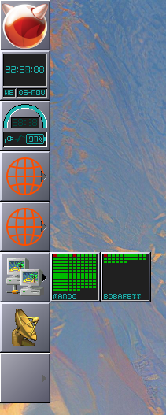

# PyWMCpuStat

Remote CPU stat. Each cpu represented as a box.
Green to Red color to show load.

Supports up to 128cpu's 

### Mentions

This software is based on efforts made by [@gryf on wmdocklib](https://github.com/gryf/wmdocklib) and [pywmtemp](https://github.com/gryf/pywmtemp).

## Setup
System uses SSH to remotely run command on `remote` and then takes the result for further processing.

## Example

```bash
./pywmcpustat.py --name boba --remote boba.conrock.arpa
```

[]
